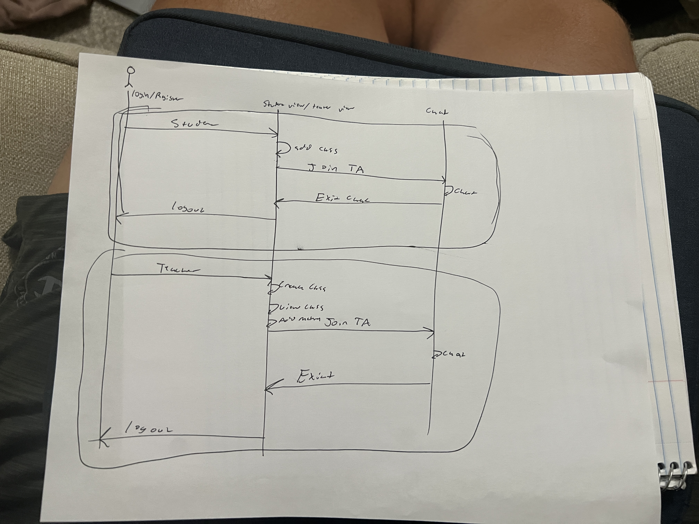

# Polyrhythmd - Music Review Platform

[My Notes](notes.md)

Polyrhythmd is a music review platform designed for the music critic in all of us. Users can discover, review, and share their thoughts on albums while connecting with other music enthusiasts in a community-driven environment.

## 🚀 Specification Deliverable

> [!NOTE]
>  Fill in this sections as the submission artifact for this deliverable. You can refer to this [example](https://github.com/webprogramming260/startup-example/blob/main/README.md) for inspiration.

For this deliverable I did the following. I checked the box `[x]` and added a description for things I completed.

- [x] Proper use of Markdown
- [x] A concise and compelling elevator pitch
- [x] Description of key features
- [x] Description of how you will use each technology
- [x] One or more rough sketches of your application. Images must be embedded in this file using Markdown image references.

### Elevator pitch

Music discovery shouldn't be limited to algorithmic recommendations. Polyrhythmd empowers music lovers to share honest reviews, discover albums through community recommendations, and connect with others who share their musical tastes. Users can search for albums, write detailed reviews with ratings, follow other critics, and build their own music discovery feed. Whether you're a casual listener or a serious music critic, Polyrhythmd provides the tools to explore, evaluate, and share your musical journey with a community that values authentic opinions over popularity metrics.

### Design

The application features a clean, music-focused interface designed for easy navigation and content discovery:

**Authentication Flow**: Simple login and registration system allowing users to create accounts and manage their profiles.

**User Profiles**: Personalized spaces where users can showcase their favorite genres, view their review history, and customize their musical identity.

**Album Search & Review**: Integrated search functionality for finding albums, with detailed review forms including star ratings, written reviews, and tagging systems.

**Social Feed**: Community-driven discovery feed where users can see reviews from followed critics, trending albums, and personalized recommendations.

**Music Discovery**: Browse albums by genre, rating, popularity, or through user-curated lists and recommendations.

### Key Features

- **Album Search & Discovery**: Search for albums with integrated music database
- **Review System**: Write detailed reviews with 0.5-5 star ratings and custom tags
- **User Profiles**: Customizable profiles with favorite genres and review history
- **Social Feed**: Follow other users and see their latest reviews and discoveries
- **Rating Analytics**: View aggregate ratings and detailed review breakdowns
- **Music Recommendations**: Get personalized suggestions based on your review history
- **Community Features**: Like, comment on, and share reviews with other users

### Technologies

I am going to use the required technologies in the following ways.

- **HTML** - Proper HTML structure for authentication pages, user profiles, album search interface, review creation forms, and social feed displays. Semantic elements ensure accessibility and clean navigation throughout the application.

- **CSS** - Professional responsive design with a dark theme featuring orange-pink gradient branding. Modern UI elements including album art displays, review cards, rating components, and smooth transitions. Responsive grid layouts optimized for both desktop and mobile viewing.

- **React** - Component-based architecture featuring:
  - Authentication components for login/registration
  - Album search and display components with dynamic filtering
  - Review creation and editing interfaces
  - User profile management and customization
  - Social feed with infinite scroll and real-time updates
  - Rating and tagging systems with interactive elements

- **Service** - Backend service providing:
  - User authentication and session management
  - Album data integration with music APIs (Spotify/Last.fm)
  - Review creation, editing, and retrieval endpoints
  - User profile management and social following systems
  - Search functionality with filtering and sorting
  - Recommendation engine based on user preferences and behavior

- **DB/Login** - MongoDB storage for:
  - User accounts with encrypted passwords and profile data
  - Album information and metadata cache
  - User reviews with ratings, text content, and tags
  - Social connections and following relationships
  - User preferences and recommendation data
  - Secure session management with role-based access

- **WebSocket** - Real-time features including:
  - Live updates for new reviews and ratings
  - Real-time notifications for follows, likes, and comments
  - Live activity feed updates
  - Instant search suggestions and auto-complete
  - Real-time recommendation updates based on user activity

## 🚀 AWS deliverable

For this deliverable I did the following. I checked the box `[x]` and added a description for things I completed.

- [x] **Server deployed and accessible with custom domain name** - [My server link](https://polyrhythmd.com/).

## 🚀 HTML deliverable

For this deliverable I did the following. I checked the box `[x]` and added a description for things I completed.

I completed all of the HTML files needed and explicitly put down where I was going to put each part. I have a login, images, db data place holder, api place holder, and WebSocket place holder.

- [x] **HTML pages**
- [x] **Proper HTML element usage**
- [x] **Links**
- [x] **Text**
- [x] **Images**
- [x] **Login placeholder**
- [x] **DB data placeholder**
- [x] **WebSocket placeholder**

## 🚀 CSS deliverable

For this deliverable I did the following. I checked the box `[x]` and added a description for things I completed.

- [x] **Header, footer, and main content body** 
- [x] **Navigation elements**
- [x] **Responsive to window resizing**
- [x] **Application elements** 
- [x] **Application text content**
- [x] **Application images**

## 🚀 React part 1: Routing deliverable

For this deliverable I did the following. I checked the box `[x]` and added a description for things I completed.

- [ ] **Bundled using Vite** - I did not complete this part of the deliverable.
- [ ] **Components** - I did not complete this part of the deliverable.
- [ ] **Router** - I did not complete this part of the deliverable.

## 🚀 React part 2: Reactivity deliverable

For this deliverable I did the following. I checked the box `[x]` and added a description for things I completed.

- [ ] **All functionality implemented or mocked out** - I did not complete this part of the deliverable.
- [ ] **Hooks** - I did not complete this part of the deliverable.

## 🚀 Service deliverable

For this deliverable I did the following. I checked the box `[x]` and added a description for things I completed.

- [ ] **Node.js/Express HTTP service** - I did not complete this part of the deliverable.
- [ ] **Static middleware for frontend** - I did not complete this part of the deliverable.
- [ ] **Calls to third party endpoints** - I did not complete this part of the deliverable.
- [ ] **Backend service endpoints** - I did not complete this part of the deliverable.
- [ ] **Frontend calls service endpoints** - I did not complete this part of the deliverable.
- [ ] **Supports registration, login, logout, and restricted endpoint** - I did not complete this part of the deliverable.

## 🚀 DB deliverable

For this deliverable I did the following. I checked the box `[x]` and added a description for things I completed.

- [ ] **Stores data in MongoDB** - I did not complete this part of the deliverable.
- [ ] **Stores credentials in MongoDB** - I did not complete this part of the deliverable.

## 🚀 WebSocket deliverable

For this deliverable I did the following. I checked the box `[x]` and added a description for things I completed.

- [ ] **Backend listens for WebSocket connection** - I did not complete this part of the deliverable.
- [ ] **Frontend makes WebSocket connection** - I did not complete this part of the deliverable.
- [ ] **Data sent over WebSocket connection** - I did not complete this part of the deliverable.
- [ ] **WebSocket data displayed** - I did not complete this part of the deliverable.
- [ ] **Application is fully functional** - I did not complete this part of the deliverable.

Here is my first edit!
edit in web consol